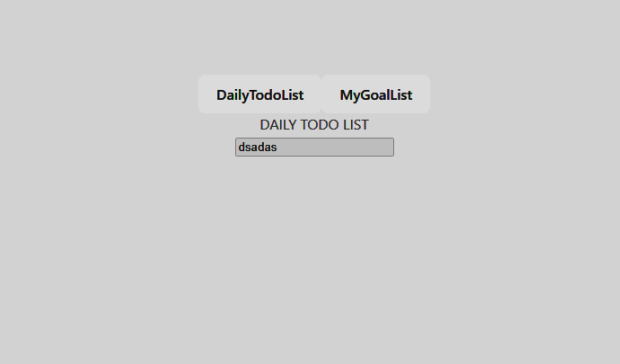
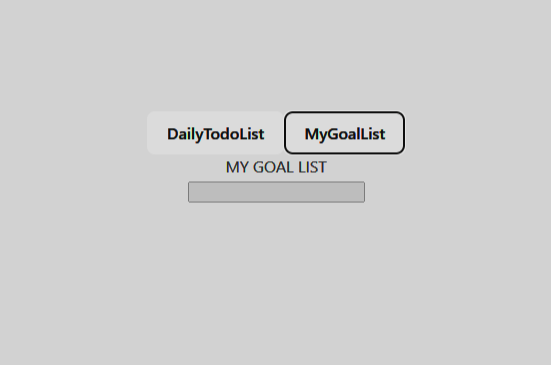
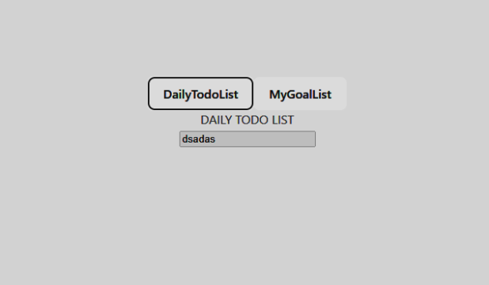

# Diving Deeper into Components
## Global & Local Components
Projelerimizde bileşenler global ve local olmak üzere 2 şekilde tanımlanır.
<br/>

- Global Tanımlama:
<br/>

Main.js (Projenin ana script dosyası) içine tanımlanırlar ve diğer bileşenlerde ```import```
kullanılarak ulaşılmazlar direkt olarak ulaşım imkanı vardır.
<br/>

Global tanımlama tüm bileşenler için yapılmaz, UI için tasarlanan bileşenler (modal,
drawer, popover vs.), yardımcı bileşenler, sık kullanılan genel bileşenlerin global
tanımlanması daha mantıklıdır.
```
// main.js veya başka bir giriş noktası dosyası
import { createApp } from 'vue';
import App from './App.vue';
import GlobalComponent1 from './components/GlobalComponent1.vue';
import GlobalComponent2 from './components/GlobalComponent2.vue';
import GlobalComponent3 from './components/GlobalComponent3.vue';

const app = createApp(App);
// Birden çok bileşeni toplu olarak tanımlama
app.component({
    'global-component-1': GlobalComponent1,
    'global-component-2': GlobalComponent2,
    'global-component-3': GlobalComponent3
});
app.mount('#app');
```
- Local Tanımlama:
<br/>
Bu tanımlama bizim bildiğimiz tanımlamadır. Diğer bileşen içlerinden import edilerek kullanılır. Aksi takdirde kullanılamaz.

## Scoped Styles
```
// DefaultComponent.vue isimli bileşenimiz
<template>
    <div> Selam! </div>
</template>

<script setup lang="ts" />

<style>
    div {
        background-color: dodgerblue;
    }
</style>
```
Bu bizim sıradan bir vue bileşenimiz. Vue bileşenlerinde ```<style>``` etiketi bu şekilde
kullanıldığında komponent dışını yani bütün projeyi etkiler. Bu örnekte yazılan style
bütün projede ki ```div``` elementlerini etkiledi.
<br/>
Peki sadece bileşen içini etkileyen bir yazım mevcut mu? Evet!
```
<style scoped>
    div {
        background-color: dodgerblue;
    }
</style>
```
Bu yazım ile burada yazılan tüm css sadece bu bileşeni etkiler.
## Slots
Türkçesiyle ‘Yuvalar’
<br/>
Vue 3'teki slotlar, bileşenlerin içeriğini dinamik olarak değiştirmek için kullanılır. Slotlar,
bileşenin kullanıldığı yerde tanımlanan içeriği alır ve bileşenin kendisi tarafından işlenir.
<br/>

Html içeriklerimizi olduğu gibi önceden hazırladığımız herhangi bir alanda koymak
istiyorsak slot kullanmalıyız. Örneğin:
```
// Dosya adı: important-content.vue
<template>
<div class="content-zone">
    <slot><slot>
</div>
</template>
<script />

<style scoped>
.content-zone {
    background-color: #333;
    border: 1px solid gray;
    border-radius: 4px;
}
</style>
```
Burada elimizde bulundurduğumuz herhangi bir içeriği görüntülemek için 
importantcontent.vue bileşenini ```template``` ```script``` ve ```style``` olarak hazırladık
ve dışarıdan gelecek html içeriğinin görüntüleneceği yeri ```<slot>``` ile belirttik. 
Şimdi sıra bunu kullanmakta.
```
// Dosya adı: any-page.vue
<template>
    <important-content>
        <template>
            {/* Kendi HTML İçeriğimizi giriyoruz */}
            <div>
                <h2>Başlık Deneme</h2>
                <p>içeriğimi giriyorum...</p>
            </div>
            {/* Hemen üstümüzde ki div important-content-vue içerisindeki slota yerleşecek */}
        </template>
    </important-content>
</template>
<script setup lang="ts">

import ImportantContentComponent from "./important-content.vue";
</script>
<style scoped></style>
```
Yorum satırlarında yazdığımız gibi template içindeki alan o bileşenin slotu ile yer
değiştirir.
<br />

Not: Birden fazla slot kullanmak mümkün ama birden fazla slot kullanırken
hepsinin ismini belirtmek zorunludur.
```
<template>
    <div class="content-zone">
        <slot name="content"><slot>
    </div>
    <div class="popover">
        <slot name="popover"></slot>
    </div>
</template>
```
Hangi slotu kullanmak istediğimizi ise şu şekilde belirtiyoruz.
```
<template>
    <important-content>
        <template #content>
            <div>
                <h2>Başlık Deneme</h2>
                <p>içeriğimi giriyorum...</p>
            </div>
        </template>
        <template #popover>
            <div> Popover İçeriği </div>
        </template>
    </important-content>
</template>
```

```#name``` veya ```v-slot:name``` olarak slot isimlerini belirtebiliriz.
<br/>

Son olarak slotlara göndereceğimiz HTML içerikleri gönderdiğimiz bileşende ki
css’ten etkilenmez yazıldığı bileşen içinden etkilenir.

## Dynamic Components
Dinamik Bileşenler Vue’nun bize sunduğu harika özelliklerden bir tanesi <component>
isimli bir etiket açarak koşul ifadesi gerektiren kodu uzun ve karmaşık bir hale sokan
durumlardan bizi kurtarıyor. Örnek;
```
<template>
    <button @click="setListName('my-movies')">Movies</button>
    <button @click="setListName('my-books')">Books</button>
    <my-movies v-if="listName === 'my-movies'" />
    <my-books v-if="listName === 'my-books'" />
</template>
```
Bu kodumuzu artık şu şekil yazabiliriz.
```
<template>
    <div>
        <button @click="changeComponent('daily-todo-list')">DailyTodoList</button>
        <button @click="changeComponent('my-goal-list')">MyGoalList</button>
        <component :is="getComponent" />
    </div>
</template>

<script setup lang="ts">
import { ref, computed, defineAsyncComponent } from 'vue';

const currentComponent = ref<string>('');
const getComponent = computed(() => {
switch (currentComponent.value) {
    case 'daily-todo-list':
        return DailyTodoList;
    default:
        return MyGoalList;
    }
});
const changeComponent = (componentName: string) => {
    currentComponent.value = componentName;
};
const DailyTodoList = defineAsyncComponent(() => import('./components/DailyTodoList.vue'));
const MyGoalList = defineAsyncComponent(() => import('./components/MyGoalList.vue'));
</script>
```
Burada dikkat etmemiz gereken tek nokta; listName bileşen adıdır ve bu bileşen adı
hedef bileşenin adı ile aynı olmak zorundadır.
## Keeping Dynamic Components Alive!
Dinamik bileşenler her geçişte DOM üzerinden kaldırılıp tekrar kurulur ve böylece
üzerinde yaptığımız her değişiklik yok olur bunu önlemek için ```<keep-alive>``` etiketi
kullanabiliriz.
```
<template>
    <div>
        <button @click="changeComponent('daily-todo-list')">DailyTodoList</button>
        <button @click="changeComponent('my-goal-list')">MyGoalList</button>
        <keep-alive>
            <component :is="getComponent" />
        </keep-alive>
    </div>
</template>
```
Değişikliklerimizi yaptık…

Bileşenler arasında geçiş yaptık…

ve değişikliklerimizin korunduğunu görüyoruz.


## Teleporting Elements
Vue 3'de ```<teleport>``` bileşeni, bir bileşenin DOM hiyerarşisinde farklı bir konuma
yerleştirilmesini sağlayan bir özelliktir. Böylece bir bileşeni, DOM ağacının başka bir
noktasına taşıyabilirsiniz.
<br/>
```<teleport>``` kullanmanın bazı avantajları şunlardır:
1. DOM Yerleşimi: Bileşenin DOM ağacındaki yerini değiştirebilirsiniz. Örneğin, bir
   modal bileşenini ```<teleport>``` kullanarak ```<body>``` etiketi içine taşıyabilirsiniz. Bu, modal
   bileşeninin diğer bileşenlerin üzerinde görünmesini sağlar.
2. CSS Etkisi: Bileşenin yerleştirildiği konuma göre CSS etkilerini koruyabilirsiniz.
   Böylece bileşenin stilini başka bir bileşenin içinde veya dışında tutabilirsiniz.
3. Z-Index Problemlerini Önler: ```<teleport>``` kullanarak bileşeninizi ```<body>``` etiketi içine
   taşıdığınızda, z-index değerleriyle ilgili sıkıntılar yaşamazsınız. Modal gibi üst
   katman bileşenleri kullanırken bu özellik çok yararlıdır.
4. Bileşen Ayrımı: Bileşen içindeki kodu ve mantığı, DOM yapısı ve konumundan ayrı
   tutabilirsiniz. Bu, daha modüler bir yapı oluşturmanıza ve bileşenleri tekrar
   kullanmanıza yardımcı olur.
<br />
Örnek:
```
<template>
    <!-- Kod içeriği -->
    <teleport to="body"> /* id veya class ismi de verilebilir */
        <dialog open v-if="isError">
            <h2>ERROR</h2>
        </dialog>
    </teleport>
</template>
```
Burada error ile karşılaştığında beliren bir dialog etiketimiz var. Dialog, modal gibi tüm
ekranı öncelikli olarak kaplayan yapıların diğer bileşenlerle iç içe olması anlamsal olarak
doğru olmadığı gibi tüm ekranda üstünlük kurması gereken bu yapılar bileşenler
arasında ezilip doğru görüntüyü vermeyebilir.