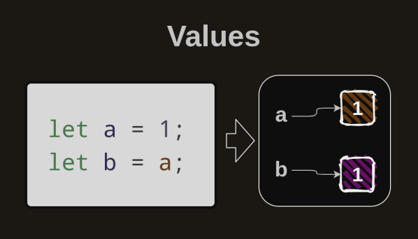
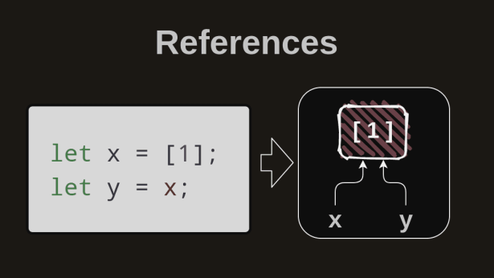

# Types In JS

## Javascript Types

#### Primitive Types

- Number
- String
- Boolean
- Null
- Undefined
- Symbol

#### Non-Primitive Types

- Object (obje, array, set)
- Function
  Javascript’in bilinen bütün tipleri bunlardır.

## Array.isArray()

Arrayler, typeof ile bize ‘object’ döner. Değişkenimizin array olup olmadığını bu şekil
anlayabiliriz.

```
Array.isArray(variable_name);
```

## Pass by Value & Pass by Reference

Değişkenler arasında veri aktarılırken 2 türlü aktarım vardır. Primitive Tipler “pass by
value” ile aktarım yapar.
“pass by value” metodunda değerler ayrı bir bellekte tutulurlar.

“pass by reference” ise objeler için geçerlidir ve şöyle çalışır;


Yani “pass by value” durumunda değişkenler için bellekte ayrı yerler vardır. Referans
durumunda ise veriler için değişkenlerimiz referans adresini tutar. O yüzden yapılan
değişiklikler aynı referans adresini gösteren diğer değişkenleri de etkiler.

```
var val1 = { a: 1 };
var val2 = val1;
val1.a = 2;
console.log(val2);
// output: { a : 2 }
```

```
var val1 = [1]; // typeof 'object'
var val2 = val1;
val1.push(2);
console.log(val2);
```

2 örnekte de val2 değişkeni anlattığımız gibi değişime uğradı.
<br />
“pass by reference” ilei işlerimizi yürütmeye çalıştığımızda temel sorunumuz şudur ki
aktarım olduktan sonra değişim yapamıyoruz bunu düzeltmek için “bad solution” şudur;

```
var val1 = { a : 1 };
var val2 = JSON.parse(JSON.stringify(val1));
val1.a = 2;
console.log(val2); // { a : 1 }
```

Bu çözüm sonrası referanslar artık aynı noktayı göstermez, başardık!
<br />
Ama aşağıdaki durumda şunu görüyoruz ki bu kötü çözüm tip koruması yapmıyor.

```
var val1 = { a : 1, b : Date.now() };
var val2 = JSON.parse(JSON.stringify(val1));
val1.a = 13;
console.log(typeof val2.b); // output: number
```

Date objemiz artık number dönüyor. Deep Clone için en iyi yöntemi şudur.
<br />
<code>structedClone()</code>

```
var val1 = { a: 1, b: Date.now() };
var val2 = structuredClone(val1);
val1.a = 2;
console.log(val2); // { a : 1, b : 1676234496873 }
```

## Type Comparison

Tip kıyaslaması Javascript için önemlidir çünkü diğer dillerden farklı olarak çalışır.
Aslında düzgün bir çalışma stili yoktur hemen bir tablo ile inceleyelim.

### Tek Değer İçin Kıyaslama

|           | True                             | False           | Açıklama                                                                 |
|-----------|----------------------------------|-----------------|--------------------------------------------------------------------------|
| Boolean   | true                             | false           |                                                                          |
| String    | str.length > 0                   | ""              | En az bir karakter bulunduran string true olur.                          |
| Number    | number != 0                      | 0               | Pozitif ve negatif tüm sayılar true, sıfır false.                        |
| Null      | -                                | null            | Null asla true dönmez.                                                   |
| Undefined | -                                | undefined       | Undefined asla true dönmez.                                              |
| Object    | {}, [] ve geri kalan tüm objeler | null, undefined | Object null veya undefined olursa false döner, boş olsa bile true döner. |

### Çift Eşittir İle Kıyaslama

Çift eşittir ile kıyaslama yapılırken tipler dikkate alınmaz örneğin;
<br />
```“1” == 1``` true olarak döner.

|                   | Situation |
|-------------------|-----------|
| “” == 0           | true      |
| null == 0         | false     |
| “” == null        | false     |
| undefined == 0    | false     |
| "” == undefined   | false     |
| false == 0        | true      |
| false == “”       | true      |
| null == undefined | true      |
| NaN == NaN        | false     |

### Üçlü Eşittir İle Kıyaslama
Üçlü eşittir ile kıyaslama ile tip kontrolü de yapabiliriz. Örneğin;
<br />
```“1” == 1``` false döner.
Tablo yapmamıza gerek yok yukarıda verilen örneklerin hepsi ```false``` döner.