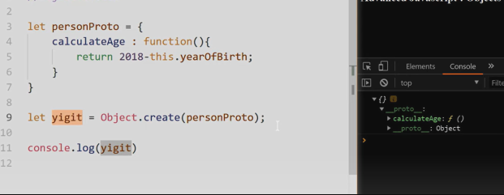
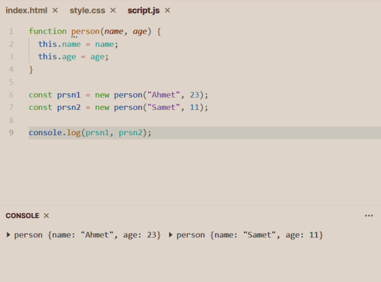
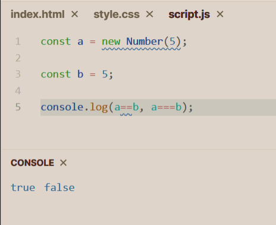
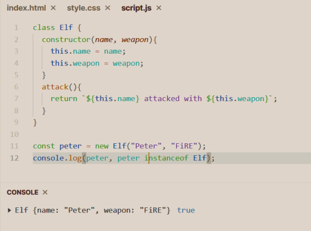
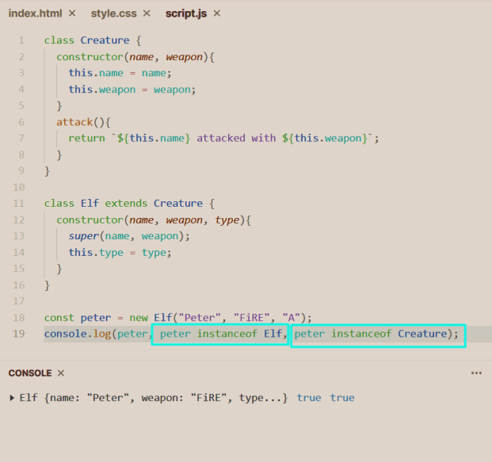
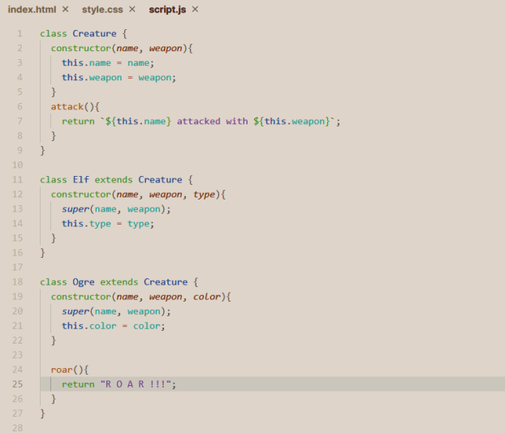
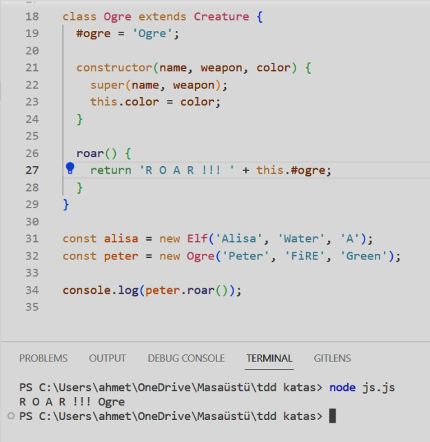
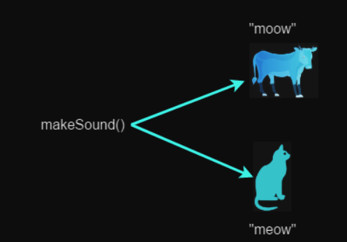

# Object Oriented Programming

Öncelikle geliştirme yapmamızı sağlayan 2 paradigma vardır:

- Fonksiyonel Programlama
- Nesne Yönelimli Programlama
  Bu paradigmalarla çalışıldığı takdirde daha duru, anlaşılabilir, sürdürülebilir ve temiz
  kodlar yazmış oluruz.
  <br />
  Not: Nesne Yönelimli Programlama, tamamen gerçek dünya nesnelerini ve ilişkilerini
  modellemekle alakalıdır.

## Factory Functions

```
const elf = {
    name: "Sam",
    weapon: "bow",
    attack(){
        return this.name + " attacked with " + this.weapon;
    }
}

console.log(elf.attack());
```

OOP, en ilkel haliyle JS üzerinde bu şekildedir fakat her seferinde nesne üretmek için
kod tekrarına düşeriz o yüzden factory function yazılabilir.

```
function createElf(name, weapon) {
    return {
        name,
        weapon,
        attack(){
            return name + " attacked with " + weapon
        }
    }

const example = createElf("Elf Sample", "Fire");
```

## Object.create()

Object.create fonksiyonu Js içinde ki kalıtım için önemlidir. Sebebi şudur ki;
<br />
Object.create bir nesnenin özelliklerini farklı bir nesnenin _proto_’suna
yüklemeye ve kalıtımı sağlamaya yardım eder.


## Constructor Functions

Contructor Functions, Java constructor’ı gibi çalışır tek farkı buradan nesne üretmek ve
bu fonksiyonu çağırmak için ```new``` rezerv kelimesini kullanmak gerekir.


- Fonksiyonlar new ile çağırılırsa constructor olur.
- Fonksiyon içinde herhangi bir değişken this ile bir property’ye atanmadıysa hiçbir
  şekilde tutulmaz.
  ::alert{type="info"}
  Not: Javascript üzerinde null ve undefined hariç her şeyin contructor metodu vardır. Örneğe bakalım:
  ::
  

## Class Keyword

```class``` anahtar kelimesi JS içine ES6 ile birlikte geldi. Bu anahtar kelimeyle C# ve Java
üzerinde gördüğümüz gibi bir kalıtım yapamayız. Aslında olan şudur;

- C# ve Java’da classlar gerçek obje yönelimli programlamaya hizmet eder ve gerçek
  hayatta ki bir şeye karşılık gelir.
- JS üzerinde ki classlar arka planda yine prototip kalıtımı yapar. Ortada nesne
  yönelimli programlama yoktur �
  
  Satır 11’de ```new``` kullandık çünkü classlarımız default olarak constructor’a sahiptir.

```this``` Kullanımı
<br />
```this``` anahtar sözcüğünü nerelerde kullanmıştık hatırlayalım.

::card-grid
#title
<code>this</code> kullanımı
#root
:ellipsis

#default
::card
#title
binding with constructor
#description
Factory Functions ve class kullanımında constructor olduğu için ```this``` anahtar
kelimesi kullanılır.
::
::card
#title
implicit binding
#description
Nesne içinde diğer propertlere erişim için kullanılır.
::
::card
#title
explicit binding
#description
<code>window</code> (nodejs için <code>global</code> ) objesinin öğelerine erişmek istiyorsak kullanırız. (örn:
this.setTimeout)
::
::

## Inheritance
Class üzerinden kalıtım ```extends``` anahtar kelimesi ile yapılır.

```creature``` class’ından bir nesne daha oluşturalım.

- ```roar``` fonksiyonu sadece ```Ogre``` ye ait.
- ```attack``` fonksiyonu kalıtım ile ```Elf``` ve ```Ogre``` classlarına da gitti.

## Private Fields
- ```#ogre``` ile değişken tanımladık bu değişkeni sadece class içinden erişilebilir yapar.
- Eğer ```ogre``` yazsaydık class dışından da erişilebilir olur.
  

## Essentials of OOP
### Polymorphism
```animal``` classımız ve ondan türetilmiş ```cow``` ve ```cat``` classlarımız var bu 3 sınıfta
```makeSound()``` metoduna sahip. (metot overloading olur.)
<br />
İşte Polymorphism burada devreye giriyor. Eğer ```cow``` classından türetilmiş bir
instance kullanıyorsak bize “moow”, ```cat``` classından bir instance kullanıyorsak bize
“meow” çıktısı verir.


### Polymorphism
Daha demin gördüğümüz kalıtımdır.

### Encapsulation
Encapsulation aslında değişkenlerin ve metotların dışarıdan erişilebilirlik durumunu
düzenler. JS içinde ```private``` ve ```public``` gibi diğer dillerde olan keywordler yoktur. O
yüzden tam bir encapsulation ilkesi var diyemeyiz fakat yukarıda şöyle bir şey
gördük ```#variable_name``` bu yazım bizim değişkenimizi dışarıdan erişilemez yapmıştı
kısmen encapsulation var diyebiliriz.

### Abstraction
