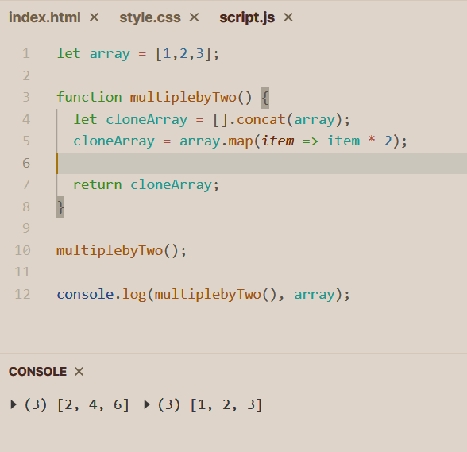
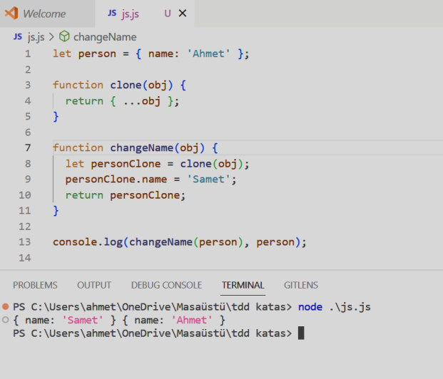
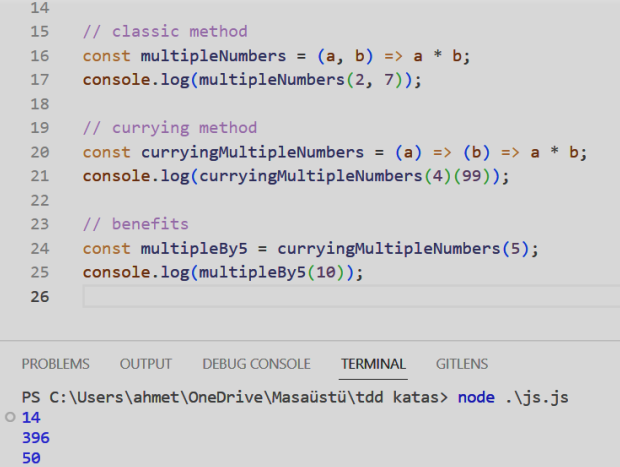
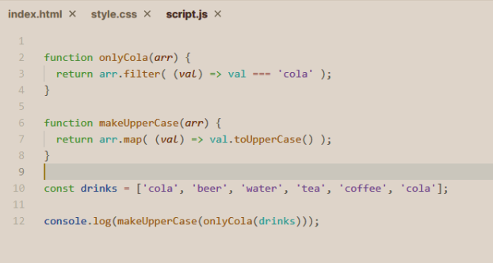
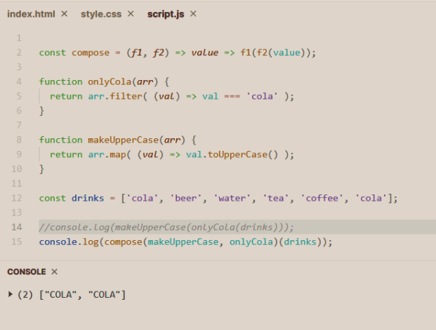
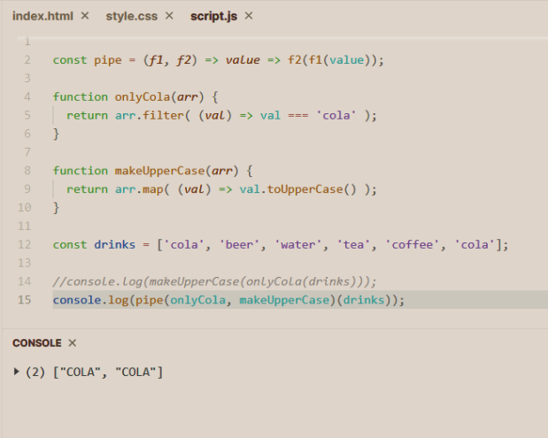

# Functional Programming
Bildiğimiz gibi, OOP 4 temel prensipe sahipti. Soyutlama, kapsülleme, çok biçimlilik ve
kalıtım. Eğer FP için prensip ararsak tek bir prensip var; **Pure Functions.**
<br />
FP ile oluşturulan tüm nesneler değişmezdir. Bir şey oluşturulduktan sonra
değiştirilemez. FP pek çok kısıtlamaya ve kurala sahiptir ancak bu FP için iyi kodlama
imkanı sağlar ve kontrolde olan bir kod yazmamızı sağlar.

## Pure Functions
Pure Functions nedir?
- Yan etkileri olmayan fonksiyonlardır.
- Aynı inputa her zaman aynı output verirler.
Yan Etkisi olan bir örnek inceleyelim.
```
let array = [1,2,3];
function multiplebyTwo() {
    array = array.map(item => item * 2);
    return array;
}

multiplebyTwo();
console.log(array);
```
Fonksiyon kendi dışındaki değişkenleri etkilemiştir yani yan etkisi vardır. Pure Function değildir.

Görüldüğü gibi burada ki fonksiyon kendi dışını etkilemedi ve verilen işlevinin gereğini
de yerine getirdi.
<br />
Özünde FP, bir grup küçük, yeniden kullanılabilir, öngörülebilir, saf fonksiyonlarla
oluşturulmuş programlar inşa etmektir.
<br />
Bu fonksiyonların özellikleri şöyle olmalıdır:
- Mükemmel fonksiyon sadece tek bir görev yapmalıdır.
- return değeri olmalıdır.
- Pure (saf) olmalıdır. Kendi dışını etkilememelidir.
- Öngörülebilir olmalı. 
- Değiştirilemez olmalı. 
- Composable (Birleştirilebilir).

## Immutability (Değişmezlik)
Değişmezlik ilkesi FP için önemli bir kavramdır. Stateler ile direkt olarak oynamak
pahalıya mal olabilir onun yerine onun bir kopyasını alıp değişiklikliği burada yapabiliriz
ve bu değişkeni döndürebiliriz.


::alert{type="info"}
High Order Function ve Closures FP için en önemli konulardır. 
<br />
Tekrar olmasın diye bu bölüme yazmadım.
<br />
Aslında kurs içeriğinde tekrardan anlatımı mevcut.
::

## Currying
Currying, birden fazla parametre alan fonksiyonları tek parametreye düşürtmektir.
Parametre çokluğu kod kalitesini düşürür. Örneğin;

Benefits kısmında anlayacağımız gibi currying’in en büyük faydası fonksiyonu
çeşitlendirebilmektir. Aksi takdirde bu durumlar içinde fonksiyon yazılması gerekir.

## Compose & Pipe
Compose & Pipe, birebir aynı çalışan iki fonksiyondur. Bu fonksiyonlar FP için bilinmesi
gereken önemli kavramlardır. Fonksiyonların belli bir sıra ile çalışmasını sağlar. Sadece
ufak bir fark vardır aralarında hemen inceleyelim.

Bu örnekte anlaşıldığı gibi arka arkaya kullandığımız 2 fonksiyon var.
- ‘cola’ stringini filtreliyoruz.
- büyük harfe çeviriyoruz.

Bu bir fonksiyon çalışma sırası. Bunu compose ve & pipe ile yapalım.

### compose

2.satırda compose ile iş sırası tanımladık.
Burada 2 fonksiyon alacağımızı ve parametre (örnekte ki drinks ) alacağımızı belirttik.

### pipe


::alert{type="info"}
<code>Not</code>: Fikrimce pipe kullanımı daha doğru sebebi ise şu compose iş sırasının ters
girilmesini istiyor. 15.satırda önce onlyCola sonra makeUpperCase fonksiyonlarını yazdık
zaten fonksiyon çalışma sıralaması bu ama compose için tam tersi.
::

## Arity
Arity, tam olarak şu demektir fonksiyonun aldığı parametre sayısı.
<br />
FP için kesin bir kural olmasa da genel kabul şudur ki; ne kadar az parametre varsa o
kadar iyidir. Parametre sayısı maximum 2 olarak belirlemek çoğu zaman işleri
kolaylaştırır.